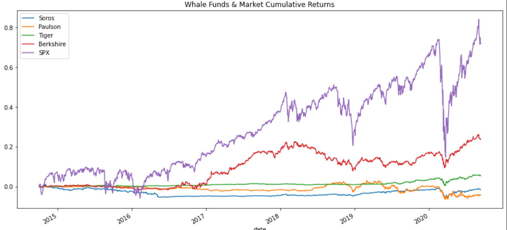
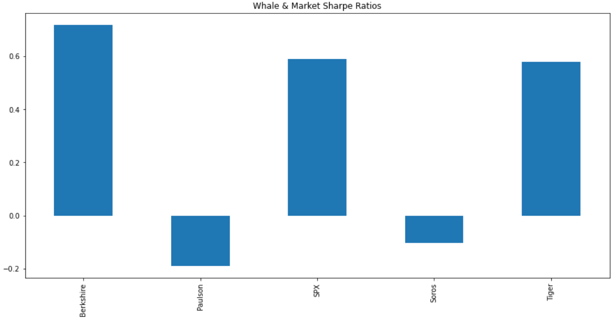
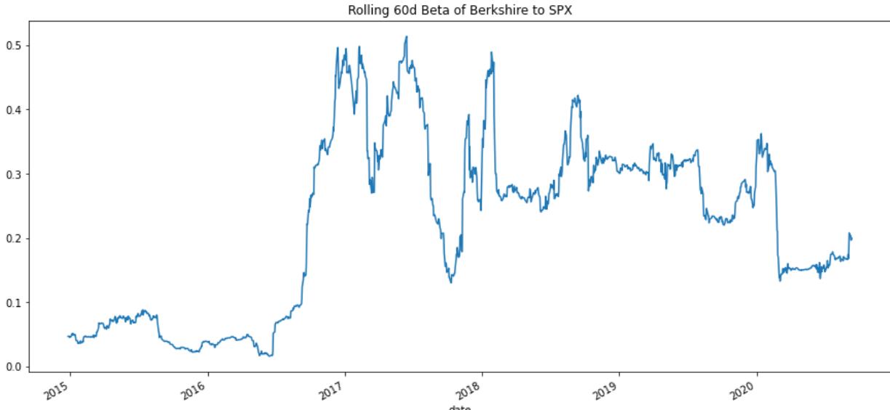

# *Analyzing Portfolio Risk and Return*

This is a Python and Pandas-based analysis of risk and return between various fund offerings and the broad market.  There were 6 phases to the analysis:  importing the data, analyzing the performance, analyzing the volatility, analyzing the risk, analyzing the risk-return profile, and diversifying the portfolio.  At the end of the analysis is a conclusion on which investment the firm should consider offering.

---

## Technologies

The application is written in Python 3.8 in a Jupyter notebook with support from the following packages:  

*[Pandas] (https://github.com/pandas) - Data analysis

*[Numpy] (https://github.com/numpy) - Comprehensive mathematical functions

*[Pathlib] (https://github.com/nemec/pathlib) - Import files

*[Matplotlib] (https://github.com/matplotlib) - Plotting tools

## Installation Guide

No special installs required.  Pls make sure you have access to the above mentioned packages.

## Usage and Content

To see the analysis, pls clone the repository and open **risk_return_analysis.ipynb** in JupyterLab.

Here are a few images from the analysis to provide a sample of what can be found:

## Contributors
Vishnu Kurella, vishnu.kurella@gmail.com

## License
VK.LQA 2021